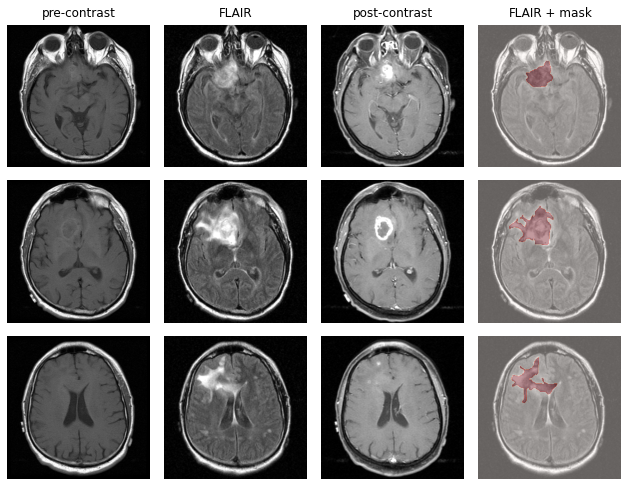

# BrainMRIDataset
This is a python interface for the TCGA-LGG dataset of brain MRIs for Lower Grade Glioma segmentation. The raw data can be downloaded from [kaggle](https://www.kaggle.com/mateuszbuda/lgg-mri-segmentation).

This dataset contains brain magnetic resonance images together with manual FLAIR abnormality segmentation masks. The images were obtained from [The Cancer Imaging Archive (TCIA)](https://wiki.cancerimagingarchive.net/display/Public/TCGA-LGG#53091882996b59483ec40a4b6af44c454f1c395). They correspond to 110 patients included in The Cancer Genome Atlas (TCGA) lower-grade glioma collection. Each patient has a different number of slices per volume, ranging from 20 to 88. For each slice of resolution 256 x 256, four images are available: pre-contrast, fluid-attenuated inversion recovery (FLAIR), post-contrast and the segmentation mask.

<p align="center">
    
</p>

## Usage
An instance of the dataset can be easily created with the following code:
```python
from brainMRI import Dataset

dataset = Dataset()
```
The dataset is partitioned in training and test data using the 80-20 ratio on the patients. By default the training samples are provided, the test data can be accessed by specifying `train=False`.

### Accessing the data
Standard indexing (i.e. ```dataset[3]``` or ```dataset[2:5]```) can be used to access samples and subsets. A single sample is a tuple ```(image, mask, metadata)``` where the metadata is a tuple itself `(patient, slice)`. By default, the image has three layers corresponding to the pre-contrast, FLAIR and post-contrast images. It is possible to specify a specific volume when initializing the dataset to retrive only one of them.
```python
dataset = Dataset(volume="FLAIR")

sample = dataset[0]
flair_img = sample[0]
mask = sample[1]
patient, slice = sample[2:]
```
The possible values of the `volume` argument can be accessed at `Dataset.VOLUMES`.

#### Sub-datasets
The individual sub-datasets and their corresponding samples can be accessed as well after initiation:
```python
dataset = Dataset()

img = dataset.images[0]
mask = dataset.masks[0]
patient = dataset.patients[0]
slice = dataset.slices[0]
```

## Dataset creation
After downloading the raw data from [kaggle](https://www.kaggle.com/mateuszbuda/lgg-mri-segmentation), the preprocessed dataset can be created by calling the static method ```make_dataset()```.
```python
from brainMRI import Dataset

Dataset.make_dataset()
```
This function will execute the following steps:
* Extract the metadata regarding the patient and slice index
* Preprocess the images (by channel) and the corresponding masks
* Create a virtual HDFS dataset (using h5py) associating the images to the corresponding metadata
